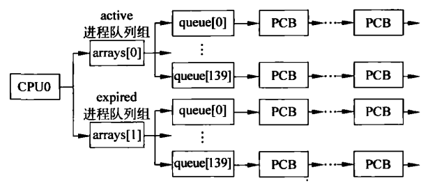

# 进程调度源码分析

## 调度 为啥 怎么 意义

## O(N)调度

### 算法思想 

### 具体实现
``` c
asmlinkage void schedule(void)
{
	struct schedule_data * sched_data;
	struct task_struct *prev, *next, *p;
	struct list_head *tmp;
	int this_cpu, c;

	if (!current->active_mm) BUG();
need_resched_back:
	prev = current;
	this_cpu = prev->processor;

	if (in_interrupt())
		goto scheduling_in_interrupt;

	release_kernel_lock(prev, this_cpu);

	/* Do "administrative" work here while we don't hold any locks */
	if (softirq_active(this_cpu) & softirq_mask(this_cpu))
		goto handle_softirq;
handle_softirq_back:

	/*
	 * 'sched_data' is protected by the fact that we can run
	 * only one process per CPU.
	 */
	sched_data = & aligned_data[this_cpu].schedule_data;

	spin_lock_irq(&runqueue_lock);

	/* move an exhausted RR process to be last.. */
	if (prev->policy == SCHED_RR)
		goto move_rr_last;
move_rr_back:

	switch (prev->state) {
		case TASK_INTERRUPTIBLE:
			if (signal_pending(prev)) {
				prev->state = TASK_RUNNING;
				break;
			}
		default:
			del_from_runqueue(prev);
		case TASK_RUNNING:
	}
	prev->need_resched = 0;

	/*
	 * this is the scheduler proper:
	 */

repeat_schedule:
	/*
	 * Default process to select..
	 */
	next = idle_task(this_cpu);
	c = -1000;
	if (prev->state == TASK_RUNNING)
		goto still_running;

still_running_back:
	list_for_each(tmp, &runqueue_head) {
		p = list_entry(tmp, struct task_struct, run_list);
		if (can_schedule(p, this_cpu)) {
			int weight = goodness(p, this_cpu, prev->active_mm);
			if (weight > c)
				c = weight, next = p;
		}
	}

	/* Do we need to re-calculate counters? */
	if (!c)
		goto recalculate;
	/*
	 * from this point on nothing can prevent us from
	 * switching to the next task, save this fact in
	 * sched_data.
	 */
	sched_data->curr = next;
#ifdef CONFIG_SMP
 	next->has_cpu = 1;
	next->processor = this_cpu;
#endif
	spin_unlock_irq(&runqueue_lock);

	if (prev == next)
		goto same_process;

#ifdef CONFIG_SMP
 	/*
 	 * maintain the per-process 'last schedule' value.
 	 * (this has to be recalculated even if we reschedule to
 	 * the same process) Currently this is only used on SMP,
	 * and it's approximate, so we do not have to maintain
	 * it while holding the runqueue spinlock.
 	 */
 	sched_data->last_schedule = get_cycles();

	/*
	 * We drop the scheduler lock early (it's a global spinlock),
	 * thus we have to lock the previous process from getting
	 * rescheduled during switch_to().
	 */

#endif /* CONFIG_SMP */

	kstat.context_swtch++;
	/*
	 * there are 3 processes which are affected by a context switch:
	 *
	 * prev == .... ==> (last => next)
	 *
	 * It's the 'much more previous' 'prev' that is on next's stack,
	 * but prev is set to (the just run) 'last' process by switch_to().
	 * This might sound slightly confusing but makes tons of sense.
	 */
	prepare_to_switch();
	{
		struct mm_struct *mm = next->mm;
		struct mm_struct *oldmm = prev->active_mm;
		if (!mm) {
			if (next->active_mm) BUG();
			next->active_mm = oldmm;
			atomic_inc(&oldmm->mm_count);
			enter_lazy_tlb(oldmm, next, this_cpu);
		} else {
			if (next->active_mm != mm) BUG();
			switch_mm(oldmm, mm, next, this_cpu);
		}

		if (!prev->mm) {
			prev->active_mm = NULL;
			mmdrop(oldmm);
		}
	}

	/*
	 * This just switches the register state and the
	 * stack.
	 */
	switch_to(prev, next, prev);
	__schedule_tail(prev);

same_process:
	reacquire_kernel_lock(current);
	if (current->need_resched)
		goto need_resched_back;

	return;

recalculate:
	{
		struct task_struct *p;
		spin_unlock_irq(&runqueue_lock);
		read_lock(&tasklist_lock);
		for_each_task(p)
			p->counter = (p->counter >> 1) + NICE_TO_TICKS(p->nice);
		read_unlock(&tasklist_lock);
		spin_lock_irq(&runqueue_lock);
	}
	goto repeat_schedule;

still_running:
	c = goodness(prev, this_cpu, prev->active_mm);
	next = prev;
	goto still_running_back;

handle_softirq:
	do_softirq();
	goto handle_softirq_back;

move_rr_last:
	if (!prev->counter) {
		prev->counter = NICE_TO_TICKS(prev->nice);
		move_last_runqueue(prev);
	}
	goto move_rr_back;

scheduling_in_interrupt:
	printk("Scheduling in interrupt\n");
	BUG();
	return;
}
```


​	细节处理

​	
## O(1)调度
### 算法思想 
把原先的就绪队列的单个链表变成了多个链表，每一个优先级的进程被挂入到不同的链表里面，系统中所有的就绪进程首先经过负载均衡模块挂入各个CPU的就绪队列上，然后由主调度器和周期性调度器驱动该CPU上的调度行为,


**runqueue结构**

每个CPU都需要维护一个 runqueue 结构，runqueue 结构主要维护任务调度相关的信息，比如优先队列、调度次数、CPU负载信息等。
``` c
struct runqueue {
    spinlock_t lock;
    unsigned long nr_running,
                  nr_switches,
                  expired_timestamp,
                  nr_uninterruptible;
    task_t *curr, *idle;
    struct mm_struct *prev_mm;
    prio_array_t *active, *expired, arrays[2];  //prio_array_t即为后文的prio_array
    int prev_cpu_load[NR_CPUS];
    task_t *migration_thread;
    struct list_head migration_queue;
    atomic_t nr_iowait;
};
```
`active`和`expired`指针类型为 `prio_array`，其分别指向array[0]、array[1]，其中active代表可以调度的任务队列，而expired字段代表时间片已经用完的任务队列，当active中的任务时间片用完，那么就会被移动到expired中。



其中为了保证交互式/实时进程的响应时间，当此类进程时间片为0时，重置其时间片并重新插入active数组，但其不能一直呆在active数组中，会导致expired中的数饥饿，所有当其占用CPU时间达到一个固定值时，将其转移到expired中，当active中已经没有任务可以运行，就把 expired与active调转。

**优先级数组的结构**

```c
struct prio_array
{
	unsigned int nr_active;
	unsigned long bitmap[BITMAP_SIZE];
	struct list_head queue[MAX_PRIO];
};
```


队列成员中有140个分别表示各优先级的链表头，其中100-139是普通进程的优先级，其余是实时进程的优先级，其被分开来进行管理，不同优先级的进程被挂入不同的链表中，`bitmap`用来表示各个优先级进程链表是空还是非空。`nr_avtive`是表示总任务数，当进行调度时，通过位图找到非空进程队列，即可以常数的时间级找到要调度的进程


##### 主调度器schedule函数

从CPU就绪队列中找到合适的进程进行调度：首先从当前活跃队列的位图中寻找第一个非空的进程链表，然后从该链表中找到第一个结点，即为最适合的进程，由于没有对结构进行遍历，其时间复杂度为O(1)，但其用复杂算法来判断进程是不是交互式进程以及进程的交互次数

使用机制和策略分离的思想，将其分为两大部分，第一个部分通过负载均衡模块将各个就绪状态的任务根据负载情况平均分配到各个CPU就绪队列上，第二部分实在各个CPU的著调度器和周期性调度器的驱动下进行单个CPU上的调度,将这部分共同的逻辑抽象出来，称为**核心调度器层**

我们也可以根据各个类型的调度器来定义自己的调度类，并以链表的形式加入到系统中

##### 调度器类

###### 实时进程调度
实时进程分为 FIFO（先进先出） 和 RR（时间轮询） 两种，其调度算法比较简单，如下：

**先进先出的实时进程调度**：如果调度器在执行某个先进先出的实时进程，那么调度器会一直运行这个进程，直至其主动放弃运行权

**时间轮询的实时进程调度**：如果调度器在执行某个时间轮询的实时进程，那么调度器会判断当前进程的时间片是否用完，如果用完的话，那么重新分配时间片给它，并且重新放置回 active 队列中，然后调度到其他同优先级或者优先级更高的实时进程进行运行

###### 普通进程调度
每个进程都要一个动态优先级和静态优先级，静态优先级不会变化在进程创建时被设置，而动态优先级会随着进程的睡眠时间而发生变化。动态优先级可以通过以下公式进行计算：

`动态优先级 = max(100, min(静态优先级 – bonus + 5), 139))`

上面公式的 bonus（奖励或惩罚） 是通过进程的睡眠时间计算出来，进程的睡眠时间越大，bonus 的值就越大，那么动态优先级就越高（前面说过优先级的值越小，优先级越高）。

当一个普通进程被添加到运行队列时，会先计算其动态优先级，然后按照动态优先级的值来添加到对应优先级的队列中。而调度器调度进程时，会先选择优先级最高的任务队列中的进程进行调度运行。

当进程的时间用完后，就需要重新进行计算。进程的运行时间片与静态优先级有关，可以通过以下公式进行计算：
```
静态优先级 < 120，运行时间片 = max((140-静态优先级)*20, MIN_TIMESLICE)
静态优先级 >= 120，运行时间片 = max((140-静态优先级)*5, MIN_TIMESLICE)
```

### 具体实现 

#### 时钟中断

时钟中断是由硬件触发的，可以通过编程来设置其频率，Linux内核一般设置为每秒产生100 ~ 1000次。时钟中断会触发调用 scheduler_tick() 内核函数，其主要工作是：减少进程的可运行时间片，如果时间片用完，那么把进程从 active 队列移动到 expired 队列中。代码如下：

## 对比 总结 感悟 
